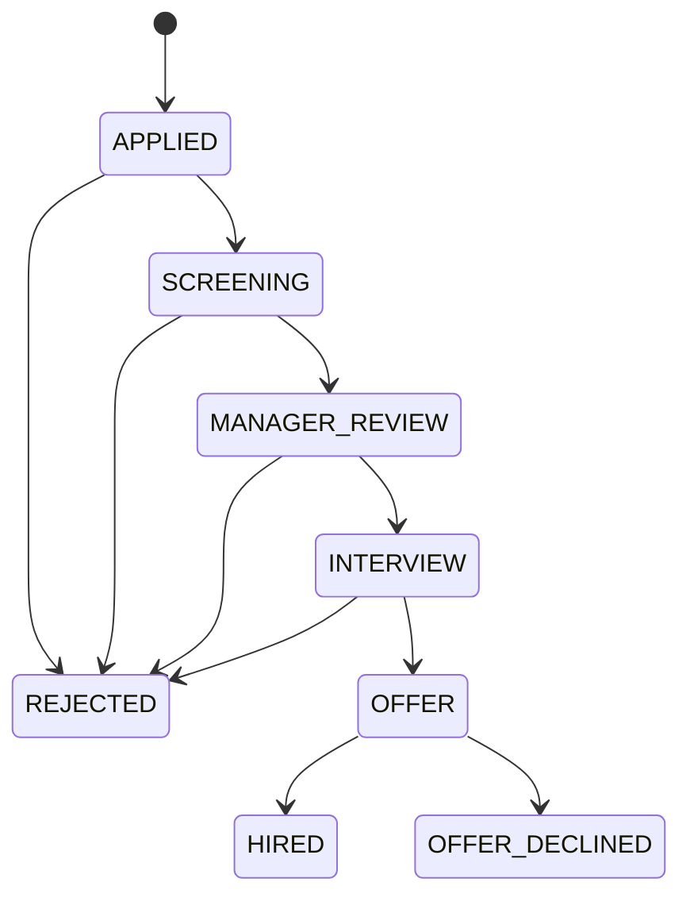

# Application Status Workflow

Tai lieu nay mo ta bo trang thai ung tuyen da duoc rut gon de dung chung cho backend, frontend, migration va seed data.

## Backend Enum

```csharp
public enum ApplicationStatus
{
    Applied = 0,
    Screening = 1,
    ManagerReview = 2,
    Interview = 3,
    Offer = 4,
    Hired = 5,
    Rejected = 6,
    OfferDeclined = 7
}
```

## Database Design

- Cot chinh: `applications.status`
- Kieu luu tru: `varchar(50)` voi bo gia tri canonical:
  - `Applied`
  - `Screening`
  - `ManagerReview`
  - `Interview`
  - `Offer`
  - `Hired`
  - `Rejected`
  - `OfferDeclined`
- Nen bo sung:
  - `CHECK (status IN (...))` sau khi du lieu cu da migrate xong
  - Index de phuc vu danh sach va dashboard:
    - `ix_applications_status`
    - `ix_applications_job_status`
    - `ix_applications_user_status`
- Nen luu history rieng neu can audit:
  - Bang `application_status_history`
  - Truong goi y: `id`, `application_id`, `from_status`, `to_status`, `changed_by`, `reason`, `changed_at`

## Frontend Mapping

| Status | Label UI |
| --- | --- |
| `Applied` | Applied |
| `Screening` | Screening |
| `ManagerReview` | Manager Review |
| `Interview` | Interview |
| `Offer` | Offer |
| `Hired` | Hired |
| `Rejected` | Rejected |
| `OfferDeclined` | Offer Declined |

## State Flow

```text
Applied -> Screening -> ManagerReview -> Interview -> Offer -> Hired
Screening -> Rejected
ManagerReview -> Rejected
Interview -> Rejected
Offer -> OfferDeclined
```

## State Transition Rules

| From | To hop le |
| --- | --- |
| `Applied` | `Screening`, `Rejected` |
| `Screening` | `ManagerReview`, `Rejected` |
| `ManagerReview` | `Interview`, `Rejected` |
| `Interview` | `Offer`, `Rejected` |
| `Offer` | `Hired`, `OfferDeclined` |
| `Hired` | Khong chuyen tiep |
| `Rejected` | Khong chuyen tiep |
| `OfferDeclined` | Khong chuyen tiep |

## Candidate Actions

| Status hien tai | Hanh dong chinh |
| --- | --- |
| `Applied` | Rut don |
| `Screening` | Rut don |
| `ManagerReview` | Rut don |
| `Interview` | Xem lich phong van, rut don |
| `Offer` | Chap nhan offer, tu choi offer |
| `Hired` | Chi xem ket qua |
| `Rejected` | Chi xem lich su |
| `OfferDeclined` | Chi xem lich su |

## Data Migration Strategy

| Status cu | Status moi |
| --- | --- |
| `Pending` | `Applied` |
| `Reviewing` | `Screening` |
| `HrScreening` | `Screening` |
| `ManagerReview` | `ManagerReview` |
| `InterviewScheduled` | `Interview` |
| `Interviewing` | `Interview` |
| `WaitingOffer` | `Offer` |
| `OfferSent` | `Offer` |
| `Offered` | `Offer` |
| `Accepted` | `Hired` |
| `Rejected` | `Rejected` |
| `OfferDeclined` | `OfferDeclined` |

## Why This Model

- `Screening` duoc dung thay cho `HrScreening` de enum ngan, ro va it phu thuoc vao ten vai tro.
- `InterviewScheduled` va cac bien the interview duoc gom vao `Interview` vi lich phong van chi la chi tiet quy trinh, khong can thanh system state rieng.
- `WaitingOffer` va `OfferSent` duoc gom vao `Offer` de trang thai tong the ngan gon; chi tiet gui offer nen nam o bang offer va lich su thao tac.

## Mermaid Diagram


